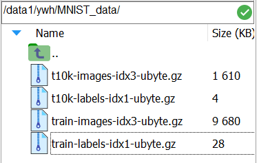
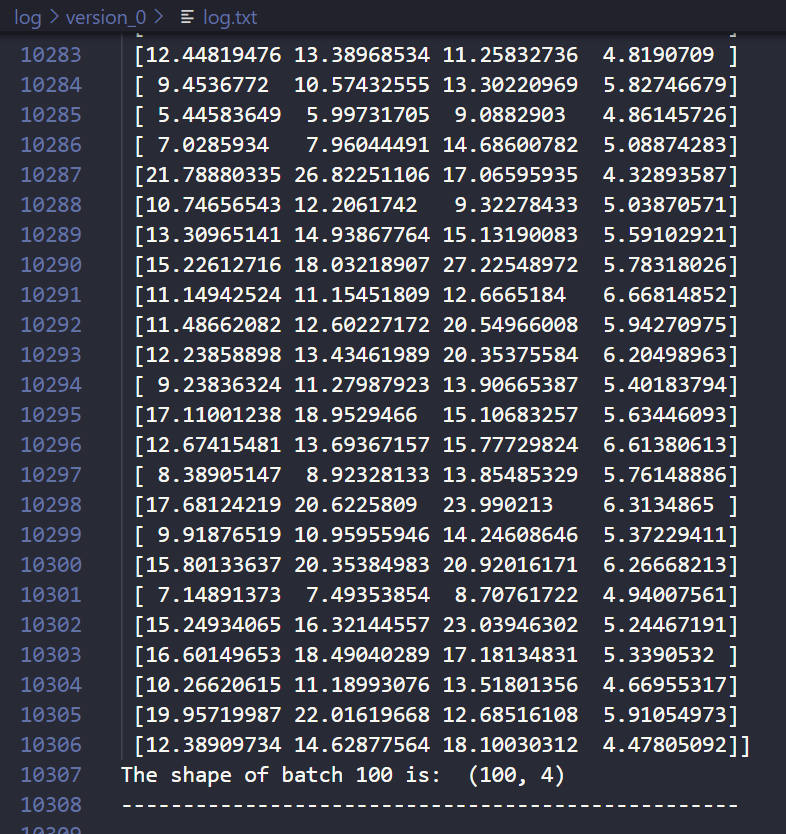

# Char-adv-using-LID-torch
There are my Pytorch codes for charactering adversarial subspace using local intrinsic dimensionality.


### Characterizing Adversarial Subspaces Using Local Intrinsic  Dimensionality
This is a paper from [Xingjun Ma](http://xingjunma.com/) publishing in ICLR'18. I hold a belief that this is a wonderful work in adversarial learning. Because this work has taken a new method to characterizing adversarial subspaces, which makes me believe that this method is also can be used in many other ways.

The author has put their codes in [[Github](https://github.com/xingjunm/lid_adversarial_subspace_detection)]. Anyway, the codes are based on Keras and little bit complicated in some ways. So what I want to do is, performing how to crafting LID examples in a single way by Pytorch which is universally used in deep learning.

### Preparing mnist dataset

Although torch and keras both have functions to download mnist automatically, but it has a lot of problems, so I recommended downloading dataset manually. 



Downloading mnist dataset from [official website](http://yann.lecun.com/exdb/mnist/). And I put them under the folder `/data1/ywh/MNIST_data`.

### LID sampled by layers of DNNs 

Local Intrinsic  Dimensionality is crafted by layers of neural network. And my codes give an example of nerual network. 

```python
self.layer1 = nn.Sequential(
            nn.Conv2d(in_channels = self.chnum_in, out_channels = feature_num, kernel_size=3),
            nn.BatchNorm2d(feature_num),
            nn.ReLU()
        )
        self.layer2 = nn.Sequential(
            nn.Conv2d(in_channels = feature_num, out_channels = feature_num, kernel_size=3),
            nn.BatchNorm2d(feature_num),
            nn.ReLU()
        )
        self.layer3 = nn.Sequential(
            nn.MaxPool2d(kernel_size=2, stride=2),
            nn.Dropout(0.5),  
            nn.Flatten(),  
            nn.Linear(feature_num_fc, feature_num_x2),            
            nn.ReLU()
        )
        self.layer4 = nn.Sequential(
            nn.BatchNorm1d(feature_num_x2), 
            nn.Dropout(0.5),  
            nn.Linear(feature_num_x2, label_num)
        )
```

This a four layer network. According to the definition of LID, the batch shape of LID is definitely (batch_size, 4). And 4 is the LID dimension.

### Running Our Codes

You can cd into the folder, and running the script like this below.

```shell
python char_lid.py --gpus 0
                   --batch_size 100
                   --exp_dir log
                   --version 0
```

After you run this script,  you will see that `log.txt` can be finded in the folder of `log/version_0/`. And `log.txt` includes 100 batches (because testing folder has 10,000 examples) of LID, each batch LID has the shape of (100, 4).



